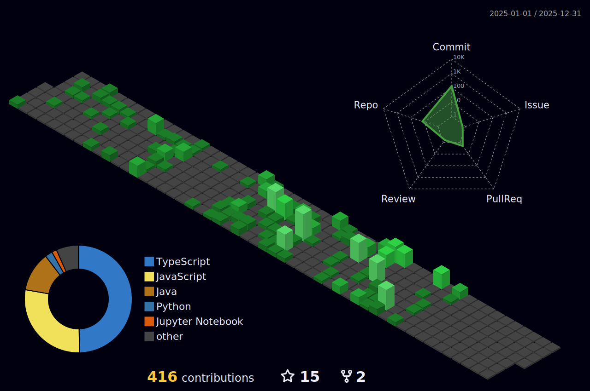

<h1 align="center">Hi 😎, I'm Sudarshan</h1>

    

<h3 align="left">Languages and Tools:</h3>

    
    
    
    
    
    
    
    
    
    
    
    
    
    
    
    
    
    
    
    
    
    
    
    
    
    
    
    
    
    
    
    
    
    
    
    
    
    
    
    
    
    
    
    
    
    
    
    
    
    
    
    

 

GitHub Stats:
 

    
    

Contribution History:
 

    

Socials:
 

  &nbsp;&nbsp;&nbsp;
  &nbsp;&nbsp;&nbsp;

